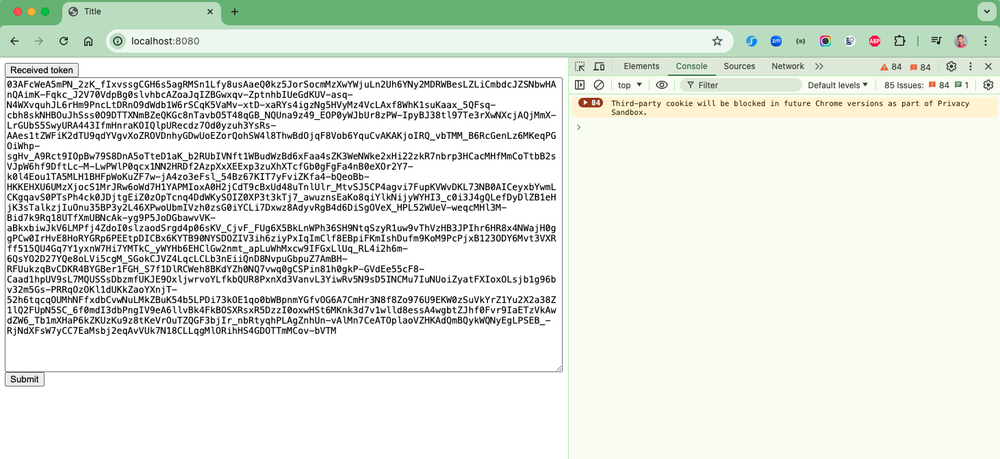
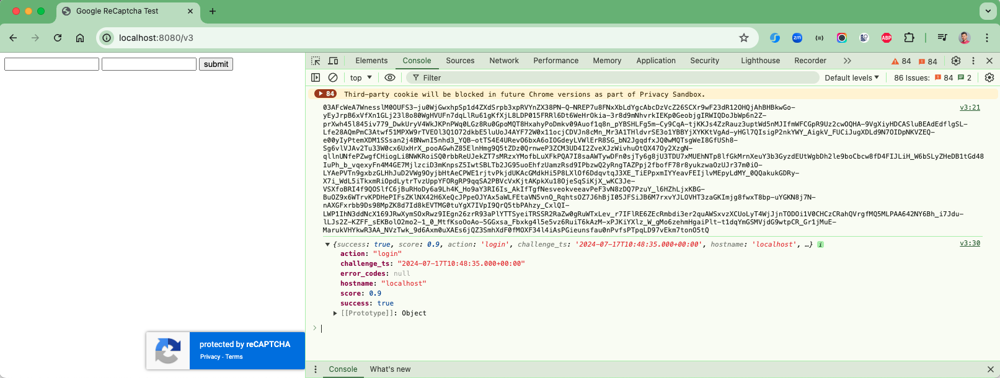
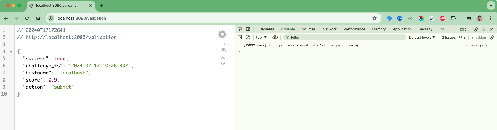

# spring-boot-capcay-v3

### Things todo list

1. Clone this repository: `git clone https://github.com/hendisantika/spring-boot-capcay-v3.git`
2. Navigate to the folder: `cd spring-boot-capcay-v3`
3. Create Google reCaptcha V3 in [your admin console](https://www.google.com/recaptcha/admin/create)
4. Run the application: `mvn clean spring-boot:run`
5. Open your favorite browser: http://localhost:8080
6. Open your favorite browser: http://localhost:8080/v3

### Images Screenshots

Sample 1

Sample 2

Response 1

